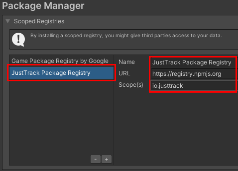
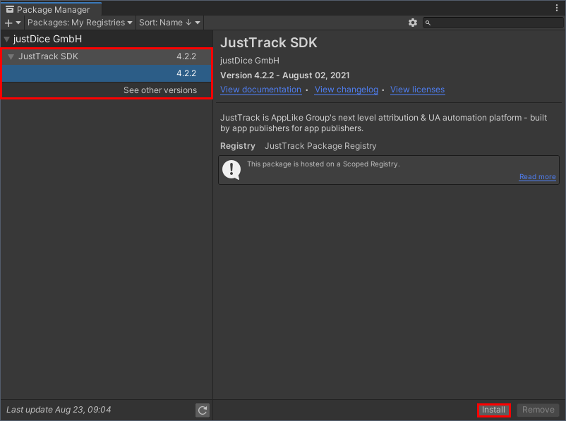
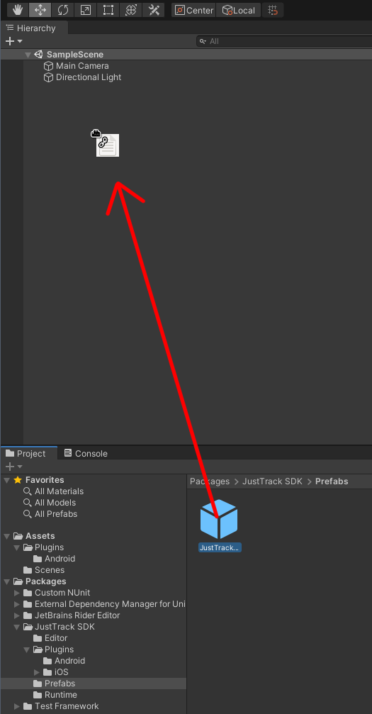
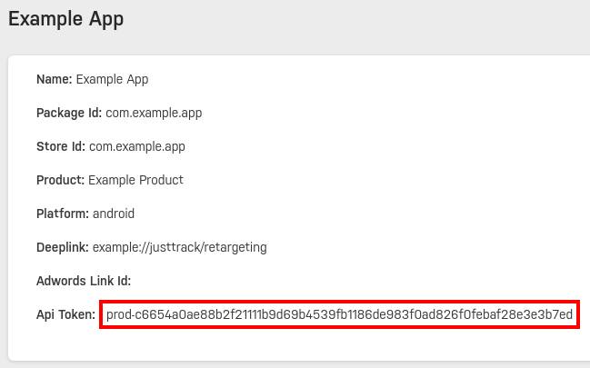
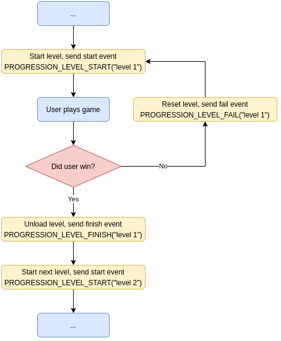
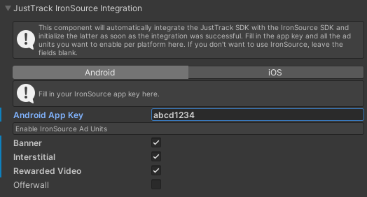

# JustTrack SDK for Unity


## Installation

The JustTrack SDK is available as a Unity package.
You have to add <https://registry.npmjs.org> as the scoped registry to add it to your game.
Navigate to `Window` → `Package Manager`, then select `Advanced Project Settings` from the gear menu.
Now add the JustTrack Package Registry to your game:



After adding the scoped registry, you need to add the JustTrack SDK to your project.
Select `Packages: My Registries` in the drop-down menu, select the `JustTrack SDK` and install it into your game.
Use the latest available version if possible.



You can also add the scoped registry and package directly to your `Packages/manifest.json`.
Afterwards, your `manifest.json` should look like this:

```json
{
  "dependencies": {
    // ... other dependencies of your game ...
    "io.justtrack.justtrack-unity-sdk": "4.2.3"
  },
  "scopedRegistries": [
    // ... other scoped registries ...
    {
      "name": "JustTrack Package Registry",
      "url": "https://registry.npmjs.org",
      "scopes": [
        "io.justtrack"
      ]
    }
  ]
}
```

Next, navigate to `Packages/JustTrack SDK/Prefabs` and add the `JustTrackSDK` prefab to your initial scene.



Select the instance of the prefab and add your API tokens for Android and iOS as applicable.
An API token looks like this:

- `sandbox-6997ca820395f4416ac78403e70b70864d4b15c272e4b9854495c624bfb69b56`
- `prod-f067440a10b63a5f49d5d9cfa1f98770bd6a329abad730bc2533789b85a124a7`

### Getting an API token

Navigate to your apps on the [JustTrack dashboard](https://dashboard.justtrack.io/admin/apps) and view your app.
If you haven't created your app on the dashboard yet, go to [Products](https://dashboard.justtrack.io/admin/products)
and create the product for your app if needed, then go to [Apps](https://dashboard.justtrack.io/admin/apps) and create your app.
This will generate the API token needed to use the JustTrack SDK and it should look like this:



Thus, for this example app, you would be using `prod-c6654a0ae88b2f21111b9d69b4539fb1186de983f0ad826f0febaf28e3e3b7ed` as the API token.

### Dependencies

The number of dependencies of the JustTrack SDK is small, but not zero.
To resolve these dependencies automatically you can use the [External Dependency Manager](https://github.com/googlesamples/unity-jar-resolver) from Google.
If you are not already using it, you can download it from <https://developers.google.com/unity/archive> as a [.unitypackage](https://github.com/googlesamples/unity-jar-resolver/raw/v1.2.165/external-dependency-manager-1.2.165.unitypackage) file.
After importing it to your project, it should pick up the dependencies specified in `JustTrackSDKDependencies.xml` from this package and begin downloading them.

## Configuration

The minimal configuration of the SDK consists of setting the correct API token (see the [install instructions](./INSTALL.md)) and configuring a tracking id provider.
The tracking id provider allows the SDK to deal with the case if no Google Advertiser Id (GAID) or IDFA (on iOS) is available.
For Android this is normally not needed as the GAID is available for most users.
On iOS a user can prevent the IDFA from being present and starting with iOS 14 Apple is much more restrictive about when it is available at all.
Thus, on iOS you are required to provide the JustTrack SDK with a tracking id.

We currently support only **Appsflyer** as a tracking provider.
If you are already using the Appsflyer SDK in your app, you can select Appsflyer as the tracking provider for a platform and the JustTrack SDK will take care of the rest.

If you don't use the Appsflyer SDK, select *Google Advertiser Id* on Android as the tracking id provider.
In this case the SDK will use the Google Advertiser Id to determine the identity of a user.

The tracking id provider *Manual Initialization* is an escape hatch if you choose to provide the tracking id yourself.
This will most likely have the consequence that the JustTrack backend can't attribute users to the correct campaigns though.
Only use this after talking with the JustTrack team and understanding the implications.

If you are using *Manual Initialization*, you have to pass your tracking id to the JustTrack SDK at least once like this:

```cs
using JustTrack;

var trackingId = getYourTrackingId();
JustTrackSDK.SetTrackingId(trackingId, "yourTrackingProvider");
```

If you fail to provide a tracking id, but have set the provider to *Manual Initialization*, the SDK will wait for you to provide it forever.

## Get an attribution

The JustTrack SDK determines on each start (if necessary and not cached) the identity and attribution of a user.
This includes the source from which the user was acquired and how old the user already is.
Consider for example that you are storing the current progress of a user in your game on your server.
Then you could implement the following to load the data for the correct user upon startup of your game:

```cs
using JustTrack;

JustTrackSDKBehaviour.GetAttribution((attribution) => {
    LoadUser(attribution.UserId); // load data for the current user...
}, (error) => {
    // handle error, maybe display a page telling the user that they seem to be offline...
});
```

If the attribution failed because we could not reach the JustTrack backend (user might be offline), we will automatically retry it as soon as network connectivity is restored.
In that case, you need to subscribe to the `OnAttributionResponse` callback to be notified about the attribution.
Keep in mind that the callback can also be called if a user is attributed to a retargeting campaign.

```cs
using JustTrack;

JustTrackSDK.OnAttributionResponse += (attribution) => {
    if (!userLoaded) {
      LoadUser(attribution.UserId);
    }
};
```

The `attribution` variable will be an instance of the `AttributionResponse` class.
It looks like this:

```cs
namespace JustTrack {
    public class AttributionResponse {
        public string UserId { get; }
        public string InstallId { get; }
        public AttributionCampaign Campaign { get; }
        public string UserType { get; }
        public string Type { get; }
        public AttributionChannel Channel { get; }
        public AttributionNetwork Network { get; }
        public string SourceId { get; }
        public string SourceBundleId { get; }
        public string SourcePlacement { get; }
        public string AdsetId { get; }
        public AttributionRecruiter Recruiter { get; }
        public DateTime CreatedAt { get; }
    }

    public class AttributionCampaign {
        public int Id { get; }
        public string Name { get; }
        public string Type { get; }
    }

    public class AttributionChannel {
        public int Id { get; }
        public string Name { get; }
        public bool Incent { get; }
    }

    public class AttributionNetwork {
        public int Id { get; }
        public string Name { get; }
    }

    public class AttributionRecruiter {
        public string AdvertiserId { get; }
        public string UserId { get; }
        public string PackageId { get; }
        public string Platform { get; }
    }
}
```

## User events

To track how far a user is progressing through your app you can send a user event at specific points to the JustTrack backend.
Using this, you can determine whether there are any specific steps at which a lot of users drop out (e.g., at a specific level or before making some in-app purcharse).
The following calls are all equal and publish a user event called `event_name` to the backend:

```cs
using JustTrack;

JustTrackSDK.PublishEvent("event_name");
JustTrackSDK.PublishEvent(new EventDetails("event_name"));
JustTrackSDK.PublishEvent(new CustomUserEvent("event_name"));
JustTrackSDK.PublishEvent(new CustomUserEvent(new EventDetails("event_name")));
```

You can however add additional information to an event to easier analyze it later using the JustTrack dashboard.
The `EventDetails` class allows you to amend an event with a *category*, an *element*, and an *action*.
On the dashboard you can then filter for all events with, e.g., a specific *category*, looking at multiple connected events at the same time.
The `CustomUserEvent` class allows you to amend your events with up to three custom dimensions as well as a value and a unit.
The custom dimensions allow you to split events on the dashboard again by some criterium.
For example, in a game a player might acquire an item.
You could be interested in the rarity of each item acquired, e.g., to see how many users acquire a rare item on their first day (as the dashboard allows you to look at different cohorts of users):

```cs
using JustTrack;

void recordItemAcquire(Item item) {
  var details = new EventDetails("progression_item_acquire", "progression", "item", "acquire");
  JustTrackSDK.PublishEvent(new CustomUserEvent(details).SetDimension1(item.Rare ? "rare" : "common"));
}
```

If you need to track how much time a user needs for a level, you can attach a value and a unit to an event.
In the following example, we measure the time it takes a user to complete the level and then attach it to the event before sending it to the backend:

```cs
using JustTrack;

void recordLevelDone(double duration) {
  var details = new EventDetails("progression_level_finish", "progression", "level", "finish");
  JustTrackSDK.PublishEvent(new CustomUserEvent(details).SetValueAndUnit(duration, Unit.Seconds));
}
```

The units supported by the JustTrack SDK are **Count**, **Seconds** and **Milliseconds**.

### Standard events

In the previous example we actually did a bad emulation of an event already defined by the JustTrack SDK.
The code should actually have looked like this:

```cs
using JustTrack;

void recordLevelDone() {
  JustTrackSDK.PublishEvent(new ProgressionLevelFinishEvent(null, null));
}
```

The first two arguments in the constructor are called `elementName` and `elementId`.
Standard events accept additional dimensions next to the three custom dimensions you can use on custom user events.
For the `ProgressionLevelFinishEvent` these are `elementName` and `elementId`, which you can (but don't have to) use to record about which level you are actually talking.
Thus, a call could look like this (hardcoding the arguments for simplicity):

```cs
using JustTrack;

void recordLevelDone() {
  JustTrackSDK.PublishEvent(new ProgressionLevelFinishEvent("Tutorial", "LVL001"));
}
```

As you can see, we dropped the duration, so it seems like it is no longer available.
This is not a limitation of the standard events (for example, the `LoginProviderauthorizationFinishEvent` is a standard event which can provide a duration, too).
Instead, the JustTrack SDK is already measuring the duration for us and will provide it automatically.

### Progression time tracking

The JustTrack SDK automatically tracks the time a user spends in each level and quest you are tracking via `ProgressionLevelStartEvent` and `ProgressionQuestStartEvent`.
The tracking ends once you trigger a `ProgressionLevelFinishEvent` or `ProgressionLevelFailEvent` for levels and a `ProgressionQuestFinishEvent` or `ProgressionQuestFailEvent` for quests.
These events are then automatically modified to also carry the total time the user spend with the game open on his device.

Example: A user starts a level at 1pm and plays for 5 minutes.
He then is interrupted by a phone call and your game is running in the background for 10 minutes.
Afterwards he continues to play and finishes the level after another 3 minutes.
Once you trigger the corresponding finish event the SDK computes that the user took 8 minutes to finish the level and sends this value to the backend.
You can then later see on the JustTrack dashboard how long users take in general to complete a single level and identify levels which are unreasonably hard or too easy compared to your expectation.

There are two important aspects to this automatic tracking.
First, each time the user finishes or fails a level you have to submit another start event for that level again to restart the tracking.
If a user fails to complete a level first, we would add the time between the start and the fail event and attach it to the fail event.
If the user now retries the level without another start event getting triggered, the next fail or finish event will not have any duration attached.
Thus, there should be one start event for every fail or finish event.
The flow could look something like this:



As you can see, each event is carrying some string in the above example.
They represent the element name dimension of the events.
If two progression events carry different element names or IDs, we will treat them like separate levels and not match them.
Thus, if you send a finish event for level 2 two seconds after starting level 1 we will not add a duration of two seconds to that event, but instead look for some other start event in the past for level 2.
Similarly, quests and levels are of course different namespaces and will not be mixed, either.

## IronSource integration

If you are using IronSource to diplay ads to your users, you can integrate the JustTrack SDK with the IronSource SDK.
In that case the JustTrack SDK will initialize the IronSource SDK on your behalf and pass the JustTrack user id to the IronSource SDK.
For each platform, supply the correct app key in the prefab and enable all ad units you need.



```cs
using JustTrack;

JustTrackSDKBehaviour.OnIronSourceInitialized(() => {
  // callback called exactly once as soon as ironSource has been initialized.
  // the callback is also called if ironSource has already been initialized,
  // so you can safely setup banners or other ads in here.

  JustTrackSDKBehaviour.IronSourceInitialized == true; // always true at this point
});
```

You can then access `JustTrack.JustTrackSDKBehaviour.IronSourceInitialized` to check if IronSource already has been initialized or use `JustTrack.` to schedule a callback once it has been initialized (the callback is also invoked should IronSource already have been initialized, you do not need check for that yourself prior to this.
The callback is always asynchrounously called on the main thread).

## Get an affiliate link

Invite other users to also use our app (i.e., get an affiliate link for the current user):

```cs
var onSuccess = (string link) => {
  ...
};

var onFailure = (string msg) => {
  ...
};

JustTrackSDK.GetAffiliateLink(channel, onSuccess, onFailure);
```

## Proguard configuration (Android)

On Android the JustTrack SDK is using reflection to call from C# to the native Java implementation of the SDK.
Thus, you need to preserve the classes and method names, or the calls will fail and the SDK won't work.
Add the following to your `proguard-rules.pro` file:

```text
keep class io.justtrack.** { *; }
```

## SKAdNetwork (iOS)

The JustTrack SDK will call `SKAdNetwork.registerAppForAdNetworkAttribution` upon startup.
This will cause the device to send a postback describing the attribution of the app after 24 to 48 hours.
The SDK also registers the JustTrack backend as the receiver for the copy of the postback for the advertised app (iOS 15+).
